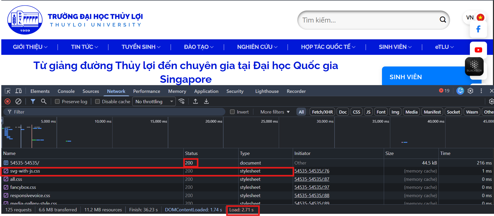
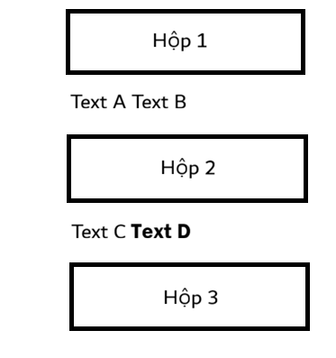

# Phần A: Kiểm tra đọc hiểu
## Câu A1
Tài liệu tham chiếu: `tuan_1_html5/01_introduction_html_universe.md`
1. Khi gõ https://shopee.vn vào trình duyệt và nhấn Enter, thứ tự các bước xảy ra:
   - Bước 1: DNS lookup
   - Bước 2: TCP handshake
   - Bước 3: TLS handshake
   - Bước 4: HTTP request gửi đi
   - Bước 5: Server trả Response
   - Bước 6: Parse HTML -> DOM/CSSOM
   - Bước 7: Render layout
2. Trong DevTools của Chrome, tab Network cho thấy thông tin của tất cả các HTTP request của trang. Lấy web tlu.edu.vn làm ví dụ
   
## Câu A2
Tài liệu tham chiếu: `tuan_1_html5/04_visible_part_html.md`  

Trang web bị Google đánh giá thấp SEO vì không dùng các thẻ Semantic, bị lạm dụng thẻ `<div>` cho mọi thành phần khiến cho Google không hiểu đâu là nội dung quan trọng nhất hay thanh điều hướng hoặc thông tin bản quyền.  

Các lỗi Semantic và cách sửa:  

Lỗi 1: `<div class="header">`, `<div class="main">`, `<div class="footer">` Google phải mất công phân tích tên class mới đoán được cấu trúc thay vì hiểu ngay lập tức.  
Sửa: dùng các thẻ `<header>`, `<main>`, và `<footer>`  

Lỗi 2: `<div class = "menu">` + `<div>` bọc thẻ các link. Đây không phải navigation, screen reader sẽ không đọc được. 
Sửa: dùng `<nav><ul><li><a>...</nav></ul></li></a>`  
  
Lỗi 3: `<div class="title">` Google không biết đây là chủ đề chính của phần nội dung này sẽ bị đánh giá thấp về nội dung.  
Sửa: dùng thẻ `<h1>` hoặc `<h2>`  

Lỗi 4: Thẻ `` chỉ có nguồn ảnh, không có thuộc tính alt.  
Sửa: Thêm thuộc tính alt="iPhone 16 Pro màu Titan" vào thẻ ``

Đoạn code sau khi sửa:  
```<header>
    <div class="logo">ShopTLU</div>
    <nav class="menu">
        <ul>
            <li><a href="/">Trang chủ</a></li>
            <li><a href="/products">Sản phẩm</a></li>
        </ul>
    </nav>
</header>

<main>
    <article class="product">
        <h1>iPhone 16 Pro</h1> 
        <p class="price">25.990.000đ</p>
        <figure class="image">
            
        </figure>
    </article>
</main>

<footer>
    <p>© 2026 ShopTLU</p>
</footer>
```  

## Câu A3

  

Giải thích:
- `<div>`: Là loại thẻ Block-level element nên luôn bắt đầu trên một dòng mới và kéo dài hết chiều rộng của vùng chứa nó, các phần tử khác không thể nằm trên cùng một dòng. Thẻ này dùng để gom nhóm các phần tử khác hoặc phân chia bố cục trang web.
- `<span>`: là loại thẻ Inline element nên không bắt đầu trên dòng mới, nó chỉ chiếm vừa đủ độ rộng nội dung bên trong nó, nằm cạnh nhau trên cùng dòng và không tạo ra line break.
- `<strong>`: tương tự như `<span>`, nó không nhảy dòng, trình duyệt sẽ tự động in đậm văn bản nằm trong thẻ này.

## Câu A4:
Tài liệu tham chiếu: `tuan_1_html5/05_tables_hyperlinks.md`

- Thẻ `<thead>`: table header - phần đầu bảng, chứa các hàng tiêu đề của bàng thường là tên các cột.
- Thẻ `<tbody>`: table body - phần thân bảng, chứa các nội dung chính của bảng, một bảng có thể có nhiều `<tbody>` để phân chia các phần dữ liệu khác nhau.
- Thẻ `<tfoot>`: table footer - phần cuối bảng, chứa phần tổng kết của bảng hoặc tinh tổng hay ghi chú.

Tại sao không nên dùng table để tạo layout trang web?
- Ảnh hưởng đến SEO và khả năng truy cập: Google và các công cụ tìm kiếm sử dụng bot để đọc nội dung web. Nếu dùng bảng để làm layout, bot sẽ hiểu nhầm đó là dữ liệu quan hệ thay vì cấu trúc trang khi đó nội dung sẽ bị đọc theo thứ tự sai logic.
- Hiệu suất tải trang chậm: trình duyệt xử lý thẻ `<table>` theo cách đặc biệt đôi khi nó phải đọc toàn bộ nội dung trong bảng thì mới bắt đầu tính toán kích thước và hiển thị lên màn hình gây ra hiện tượng trang web bị khựng hoặc trắng xóa một lúc trước khi hiện ra hoàn chỉnh.
- Bảo trì và sửa chữa cực kỳ phức tạp: việc lồng các bảng vào nhau để tạo layout sẽ tạo ra mã nguồn với hàng nghìn thẻ `<td>`, `<tr>` nên khi muốn thay đổi một chút về thiết kế gần như phải viết lại toàn bộ cấu trúc HTML thay vì chỉ cần sửa một vài dòng CSS.

#Phần B
## Bài 3:
- Lỗi 1: dòng 1 - thiếu định dạng chuẩn cho khai báo DOCTYPE - cách sửa: đổi thành `<!DOCTYPE html>`
- Lỗi 2: dòng 2 - thiếu thuộc tính `lang` trong thẻ `<html>` - cách sửa: đổi thành `<html lang="vi">`
- Lỗi 3: dòng 3 - thiếu thẻ đóng cho tiêu đề trang - cách sửa: thêm `</title>` sau phần nội dung
- Lỗi 4: dòng 4 - sai định dạng mã hóa và thiếu thuộc tính nội dung - cách sửa: sửa thành `<meta charset="UTF-8">`
- Lỗi 5: dòng 7 - thẻ `<h1>` đóng sai - cách sửa: sửa thành `<h1>Welcome to ShopTLU</h1>`
- Lỗi 6: dòng 11 - thẻ `<a>` đóng sai - cách sửa: sửa thành `<a href="home">Trang chủ<a>`
- Lỗi 7: dòng 18 - thẻ `` thiếu thuộc tính `alt` và giá trị `src` nên để trong ngoặc kép và nên dùng thẻ `<figure>` - cách sửa: ``
- Lỗi 8: dòng 20 - thẻ `<b>` và `<p>` lỗi lồng thẻ đóng sai thứ tự - cách sửa: `<p>Giá: <b>25.990.000đ</b></p>`
- Lỗi 9: dòng 25-28 - không nên sử dụng thẻ `<td>` cho tiêu đề đầu bảng - cách sửa: thay các ô Tên, Giá bằng thẻ `<th>` và nên bọc trong thẻ `<thead>`
- Lỗi 10: dòng 34 - sử dụng thẻ `<main>` lần thứ hai, mộtn trang chỉ được có duy nhất một thẻ `<main>` - cách sửa: thay `<main>` thứ hai thành thẻ `<aside>`
- Lỗi 11: dòng 39 - thẻ `<p>` chưa có thẻ đóng - cách sửa: `<p>Copyright 2026</p>`
- Lỗi 12: dòng 5 - thiếu thẻ `<meta viewport>` - cách sửa: thêm `<meta name="viewport" content="width=device-width, initial-scale=1.0">`